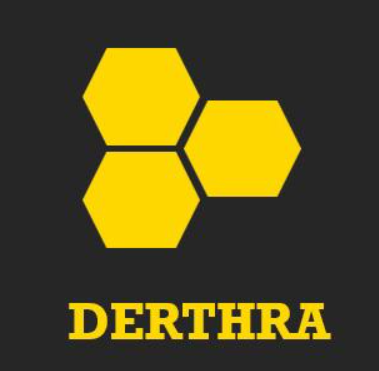

# Derthra solutions S.A.C

  

- 🌐 Pagina web de servicios especializados de sistemas y computo (Derthra solutions s.a.c),

## Derthra IA ⚙️ 

- Desarrollo de proyectos en I+D en base a IA
- Desarrollo IA para imagenes, video.
- Desarrollo de IA para voz.
- Desarrollo IA para area Industrial, Salud, Militar.
- Desarrollo de proyectos MVP area de sistemas.
- Desarrollo de proyectos IoT, sensores.

## Derthra Code ⚙️ 

- Enseñanza en programacion en C++, Python, Java, ADA
- Asesoria de tesis o tesina en la carrera de sistemas

## ROLES

1. Ingeniero de sistemas colegiado.
2. Tecnico en sistemas.
3. Tecnico en soporte informatico.
4. Tecnico electronico, mecatronico.

## COMANDOS PARA PROYECTO FRONTEND CON REACT

## UNIDEV Frontend

Este es el frontend del proyecto, creado con React y preparado para pruebas y despliegue en contenedores Docker.

---

## Scripts y Comandos NPM

### Instalación

- npm install

### Desarrollo

- npm start
  
### Build (Produccion)

- npm run build

### Testing

- npm test

## Docker

### Contruccion de la imagen

- $ docker build -t unidev-frontend .

### Ejecutar contenedor (modo produccion)

- $ docker run -d -p 3000:80 --name unidev-container-frontend unidev-frontend
- (puertolocal : puertocontenedor)

### ver logs

- $ docker logs unidev-container

### Detener contenedor

- $ docker stop unidev-container

### Eliminar contenedor

- $ docker rm unidev-container

### Eliminar imagen

- $ docker rmi unidev-frontend

### probar la aplicacion corriendo

- http://localhost:3000
